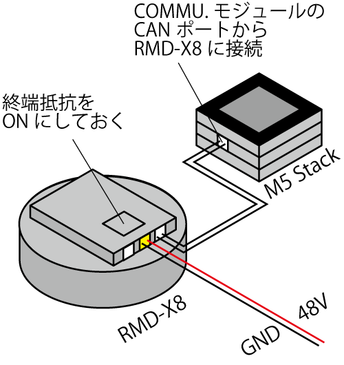

# RMD-X8をM5 Stackで動かす(1)

Gyems社制のBLDCモータ"RMD-X8"(http://www.gyems.cn/846351.html) をArduinoから駆動する方法について．

## はじめに

Boston Dynamics社SPOTやMIT cheetahなどの四足ロボットが開発され，一部は市場に出回るようになってきました．
この流れに乗ってか，小型・高出力のBLDCサーボが多く販売され始めています．しかも１台50,000円程度と安い．Dynamixel Xシリーズと同じくらいの価格帯ですね．非常に便利なので使ってみましょう．

## 必要なもの

* RMD-X8 (AliExpressで購入)
* 電源装置(48V)
* M5 Stack
* M5 Stack COMMU. モジュール

電源装置はある程度電流値を確保できるものが良いでしょう．筆者の環境ではTEXIO PSW-720L8を使用しました．

システムの構成は以下のようになります．
CAN通信には終端抵抗が必要になります．COMMUモジュール側に1個の終端抵抗が入っていますので，反対側のモータ側の終端抵抗をONにしておきましょう．
追加で終端抵抗を準備する必要はありません．




## Arduino IDEの準備

まずは，M5 Stackのプログラミング環境を整えます．筆者は情弱なので，かんたんに書けるようにArduino IDEを使います．
(参考) https://docs.m5stack.com/

1. Arduino IDEをインストールしましょう．
2. Arduino IDEを起動し，「ツール」から「ライブラリを管理」を選択して「ライブラリマネージャ」を呼び出します．
3. 「eps32」を検索し，EPS32関連のライブラリをインストール
4. 「M5」を検索し，M5 Stack関連のライブラリをインストール
5. M5 StackをPCに接続し，「ツール」から「ボード」を展開し，"M5Stack-core-ESP32"を選択します．

次に，COMMUモジュールでCAN通信ができるように`mpc_can`ライブラリを追加します．
ただし，sparkfun社のArduino用CAN-Bus shieldのライブラリも同名ですので，ここでは`mpc_can_m5`に変更します．
1. `C:\Users\ユーザー名\Documents\Arduino\libraries\M5Stack\examples\Modules\COMMU`の`MCP_CAN_lib.rar`を解凍 (windows以外の方は同じディレクトリを探してください)
2. 生成された`MPC_CAN_lib`フォルダを`C:\Users\ユーザー名\Documents\Arduino\libraries`に移動
3. `mcp_can.h`を`mcp_can_m5.h`に変更
4. `mcp_can.cpp`を`mcp_can_m5.cpp`に変更
5. `mcp_can_m5.h`をエディタで開き，`MCP_CAN`を`MCP_CAN_M5`に置換
6. `mcp_can_m5.cpp`をエディタで開き，`MCP_CAN`を`MCP_CAN_M5`に置換
あるいは， https://github.com/t-kamimura/RMDx8_m5stack をクローンし，以上の変更を済ませた"MPC_CAN_lib"フォルダを抜き出す．

## RMD-X8のCANプロトコルを確認
http://www.gyems.cn/support/download からプロトコルをダウンロードして読みましょう．

動作確認用に，PIDパラメータを問い合わせるデータはこちら．

|  Data[0]  |  Data[1]  |  Data[2]   |  Data[3]  | Data[4]  | Data[5]  |  Data[6]  |  Data[7] |
| ---- | ---- | ---- | ---- | ---- | ---- | ---- | ---- |
| 0x30 | 0x00 | 0x00 | 0x00 | 0x00 | 0x00 | 0x00 | 0x00 |

これを送ってやると，以下のようなデータが返ってきます．

|  Data[0]  |  Data[1]  |  Data[2]   |  Data[3]  | Data[4]  | Data[5]  |  Data[6]  |  Data[7] |
| ---- | ---- | ---- | ---- | ---- | ---- | ---- | ---- |
| 0x30 | 0x00 | anglePID_KP | anglePID_KI | speedPID_KP | speedPID_KI | currentPID_KP | currentPID_KI |

今回は，このデータの送受信までやってみることにしましょう．

## 送受信プログラムを作る

### 下地となるプログラム

サンプルプログラムをベースにしましょう．
Arduino IDEを開き，「ファイル」から「スケッチ例」→「M5Stack」→「Modules」→「COMMU」→「CAN」の`commu_can_receiver`と`commu_can_transmitter`を開きます．
今回は，`commu_can_receiver`をベースに`commu_can_transmitter`を合体させてプログラムを改造していきます．

「ファイル」から「名前を付けて保存」で，"RMD-X8_test"としてファイルを作っておきます．

### ライブラリ名の変更

"mpc_can.h"を書き換えたので，このクラス関連の記述を修正します．

1. 7行目の`#include<mpc_can.h>`を`#include <mcp_can_m5.h>`に変更します．
2. 26行目の`MCP_CAN CAN0(12);`を`MCP_CAN_M5 CAN0(12);`に変更します．

### 受信プログラムの改造

サンプルプログラムでは，読み込みも書き込みも` void test_can();` という関数名になっています．まずは受信する関数の名前を変更しましょう．

1. 29行目の`void test_can();`を`void read_can();`に変更
2. 81行目の`void test_can(){`を`void read_can(){`に変更
3. 55行目の`test_can();`を`read_can();`に変更

これで読み込み側は完成です．

### 送信プログラムの組み込み

"commu_can_transmitter"から，送信に関する部分を持ってきます．

1. `void read_can();`の下に`void write_can();`を追加
2. "commu_can_transmitter"の`void test_can{~}`（71行目から82行目）を全部コピーし，"RMD-X8_test"の最後の部分にペースト
3. `void test_can{~}`の名前を`void write_can{~}`に変更
4. `void loop{~}`内の`read_can();`のすぐ上に`write_can();`を追加
5. 14行目を`byte data[8] = {0x30, 0x00, 0x00, 0x00, 0x00, 0x00, 0x00, 0x00};`に変更

これで完成です．出来上がったプログラムを以下に示します．

```c
/*
  Please add MCP_CAN_LIB to your library first........
  MCP_CAN_LIB file in M5stack lib examples -> modules -> COMMU -> MCP_CAN_lib.rar
*/

#include <M5Stack.h>
#include <mcp_can_m5.h>
// #include "m5_logo.h"

/**
 * variable for loop
 */

byte data[8] = {0x30, 0x00, 0x00, 0x00, 0x00, 0x00, 0x00, 0x00};


/**
 * variable for CAN
 */
long unsigned int rxId;
unsigned char len = 0;
unsigned char rxBuf[8];
char msgString[128];                        // Array to store serial string

#define CAN0_INT 15                              // Set INT to pin 2
MCP_CAN_M5 CAN0(12);                               // Set CS to pin 10

void init_can();
void read_can();
void write_can();

void setup() {
  M5.begin();
  M5.Power.begin();
  Serial.begin(9600);
  Serial2.begin(9600, SERIAL_8N1, 16, 17);

//   M5.Lcd.pushImage(0, 0, 320, 240, (uint16_t *)gImage_logoM5);
  delay(500);
  M5.Lcd.fillScreen(BLACK);
  M5.Lcd.setTextColor(GREEN, BLACK);
  M5.Lcd.setTextSize(1);

  init_can();
  Serial.println("Test CAN...");
}

void loop() {
  if(M5.BtnA.wasPressed())
  {
    M5.Lcd.clear();
    M5.Lcd.printf("CAN Test A!\n");
    // M5.Lcd.pushImage(0, 0, 320, 240, (uint16_t *)gImage_logoM5);
    init_can();
    Serial.println("Test CAN...");
  }
  write_can();
  read_can();
  M5.update();
}

void init_can(){
  M5.Lcd.setTextSize(1);
  M5.Lcd.setCursor(0, 10);
//   M5.Lcd.pushImage(0, 0, 320, 240, (uint16_t *)gImage_logoM5);
  delay(500);

  M5.Lcd.printf("CAN Test A!\n");
  M5.Lcd.printf("Receive first, then testing for sending function!\n");

  // Initialize MCP2515 running at 16MHz with a baudrate of 500kb/s and the masks and filters disabled.
  if(CAN0.begin(MCP_ANY, CAN_1000KBPS, MCP_8MHZ) == CAN_OK)
    Serial.println("MCP2515 Initialized Successfully!");
  else
    Serial.println("Error Initializing MCP2515...");

  CAN0.setMode(MCP_NORMAL);                     // Set operation mode to normal so the MCP2515 sends acks to received data.

  pinMode(CAN0_INT, INPUT);                            // Configuring pin for /INT input

  Serial.println("MCP2515 Library Receive Example...");
}

void read_can(){
  if(!digitalRead(CAN0_INT))                         // If CAN0_INT pin is low, read receive buffer
  {
    CAN0.readMsgBuf(&rxId, &len, rxBuf);      // Read data: len = data length, buf = data byte(s)

    if((rxId & 0x80000000) == 0x80000000)     // Determine if ID is standard (11 bits) or extended (29 bits)
      sprintf(msgString, "Extended ID: 0x%.8lX  DLC: %1d  Data:", (rxId & 0x1FFFFFFF), len);
    else
      sprintf(msgString, "Standard ID: 0x%.3lX       DLC: %1d  Data:", rxId, len);

    Serial.print(msgString);
    M5.Lcd.printf(msgString);
    if((rxId & 0x40000000) == 0x40000000){    // Determine if message is a remote request frame.
      sprintf(msgString, " REMOTE REQUEST FRAME");
      Serial.print(msgString);
    } else {
      for(byte i = 0; i<len; i++){
        sprintf(msgString, " 0x%.2X", rxBuf[i]);
        Serial.print(msgString);
        M5.Lcd.printf(msgString);
      }
    }
    M5.Lcd.printf("\n");
    Serial.println();
  }
}

void write_can(){
  // send data:  ID = 0x100, Standard CAN Frame, Data length = 8 bytes, 'data' = array of data bytes to send
  byte sndStat = CAN0.sendMsgBuf(0x100, 0, 8, data);
  if(sndStat == CAN_OK){
    Serial.println("Message Sent Successfully!");
    M5.Lcd.printf("Message Sent Successfully!\n");
  } else {
    Serial.println("Error Sending Message...");
    M5.Lcd.printf("Error Sending Message...\n");
  }
  delay(200);   // send data per 200ms
}
```

## 動かしてみる

M5 stackにプログラムを書き込み，モーターとつないで電源を投入します．
モーターからデータが返ってきていたら成功です．