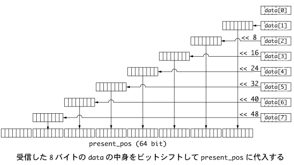

# RMD-X8をM5 Stackで動かす(2)

前回動作確認まで完了．
今回はモーターを動かすところまで進みましょう．
サンプルプログラムは https://github.com/t-kamimura/RMDx8_m5stack にあります．該当するプログラム名はそれぞれの詳細説明の中にあります．

## プロトコル

RMD-X8は標準フォーマットのCAN通信を用いています．

予め定められた形式で8バイトの情報を送信すると，それに応じて動作を行います．よく使う機能としては，

* PIDゲインの設定
* サーボの角度ゼロ設定
* モーター角度の読み込み
* 位置制御指令

などがあります．他にも速度制御，電流制御などが可能です．

よく使うコマンドを抜き出したものが以下になります．

|  指令  |  data[0]  |  data[1]  |  data[2]   |  data[3]  | data[4]  | data[5]  |  data[6]  |  data[7] |
| ---- | ---- | ---- | ---- | ---- | ---- | ---- | ---- | ---- |
|Read PID                   | 0x30	|0x00	|0x00	|0x00	|0x00	|0x00	|0x00	|0x00|
|Write PID to RAM	        | 0x31	|0x00	|angle PID KP	|angle PID KI	|speed PID KP	|speed PID KI	|current PID KP	|current PID KI|
|Read multi turn angle	    | 0x92	|0x00	|0x00	|0x00	|0x00	|0x00	|0x00	|0x00|
|(reply) Read multi angle	| 0x02  |angle low byte 1	|angle byte 2	|angle byte 3	|angle byte 4 	|angle byte 5	|angle byte 6	|angle byte 7|
|Motor off command	        | 0x80	|0x00	|0x00	|0x00	|0x00	|0x00	|0x00	|0x00|
|Motor stop command	        | 0x81	|0x00	|0x00	|0x00	|0x00	|0x00	|0x00	|0x00|
|Motor running command	    | 0x88	|0x00	|0x00	|0x00	|0x00	|0x00	|0x00	|0x00|
|Position control command 1	| 0xA3	|0x00	|0x00	|0x00	|position low byte 1	|position byte 2	|position byte 3	|position high byte 4|
|Position control command 2	| 0xA4	|0x00	|speed limit low byte	|speed limit high byte	|position low byte 1	|position byte 2	|position byte 3	|position high byte 4|

## 角度の読み込み

前回のプログラムはPIDゲインを読み取るだけでしたが，今回はモーター角度を読み取ってみましょう．

角度読み込みのサンプルプログラムは`RMD_ReadPosTest`です．

モーターにはエンコーダが取り付けられており，RMD-X8では1回転すると360000コマ動くようになっています．
エンコーダの情報をそのまま読み込む事もできますが，そうするとモーター軸1回転分しか読み込めないうえ，データが膨大な数になるので全く実用的ではありません．
そこでRMD-X8では，内部のマイコンが軸の回転数を計測してくれるという機能が備わっています．
"Multi turn angle"というやつがそれです．単位は 1 LSD = 0.001 deg となっていて，すなわち返信値が36000になったときに軸が360 deg 回転したことになります．
モーターは6:1の減速比になっていますので，モーター軸が6回転したときに出力軸が1回転することを忘れないようにしましょう．

まず，角度読み込みのプロトコルは以下のとおりです．

|  指令  |  data[0]  |  data[1]  |  data[2]   |  data[3]  | data[4]  | data[5]  |  data[6]  |  data[7] |
| ---- | ---- | ---- | ---- | ---- | ---- | ---- | ---- | ---- |
|Read multi turn angle	    | 0x92	|0x00	|0x00	|0x00	|0x00	|0x00	|0x00	|0x00|

これに対して，モーターから以下のような返信が送られてきます．

|  data[0]  |  data[1]  |  data[2]   |  data[3]  | data[4]  | data[5]  |  data[6]  |  data[7] |
| ---- | ---- | ---- | ---- | ---- | ---- | ---- | ---- |
|0x92   | angle low byte 1	|angle byte 2	|angle byte 3	|angle byte 4 	|angle byte 5	|angle byte 6	|angle byte 7|

角度データは`int64_t`型で作成され，それが1バイトごとに分割されています．
読み込んだデータはつなぎ合わせて本来のデータに戻してやりましょう．
モーターの読み込みには本来のデータ型と同じ`int64_t`型の変数を用意してやります．
<div align="center">
    
</div>

```c
int64_t present_pos = 0;
present_pos = reply_buf[1] + (reply_buf[2] << 8) + (reply_buf[3] << 16) + (reply_buf[4] << 24) + (reply_buf[5] << 32) + (reply_buf[6] << 40)　+ (reply_buf[7] << 48);
present_pos = present_pos * 0.01 / 6;
```

`<<`はビット演算子です．指定した数だけビットを動かしてやるということです．
最後の行では，読み込んだ値をモーターの出力軸角度に変換しています．
これでモーターの角度が読み込めるようになりました．


## 位置指令

RMD-X8には4種類の位置指令コマンドが用意されています．
便利なのは複数回転対応の位置指令Position command 1と，複数回転対応かつ速度制限付き位置指令のPosition command 2でしょう．
ここではPosition command 1の説明を行います．

Position command 1のサンプルプログラムは`RMD_movetest`です．

|  指令  |  data[0]  |  data[1]  |  data[2]   |  data[3]  | data[4]  | data[5]  |  data[6]  |  data[7] |
| ---- | ---- | ---- | ---- | ---- | ---- | ---- | ---- | ---- |
|Position control command 1	| 0xA3	|0x00	|0x00	|0x00	|position low byte 1	|position byte 2	|position byte 3	|position high byte 4|

位置指令は`int32_t`型で作成します．
角度の単位は角度読み取りのときと同じ定義で，1 LSD = 0.001 deg となります．
CANで送るときは，32ビット(=4バイト)で表された位置を4つのバイトに分割してやります．

```c
pos_byte[0] = pos_target & 0xFF;
pos_byte[1] = (pos_target >> 8) & 0xFF;
pos_byte[2] = (pos_target >> 16) & 0xFF;
pos_byte[3] = (pos_target >> 24) & 0xFF;
```

念のために，右シフトした後，下から8ビットより上はすべてゼロになるように`$ 0xFF`としています．
（`0xFF = 0b00000000`）